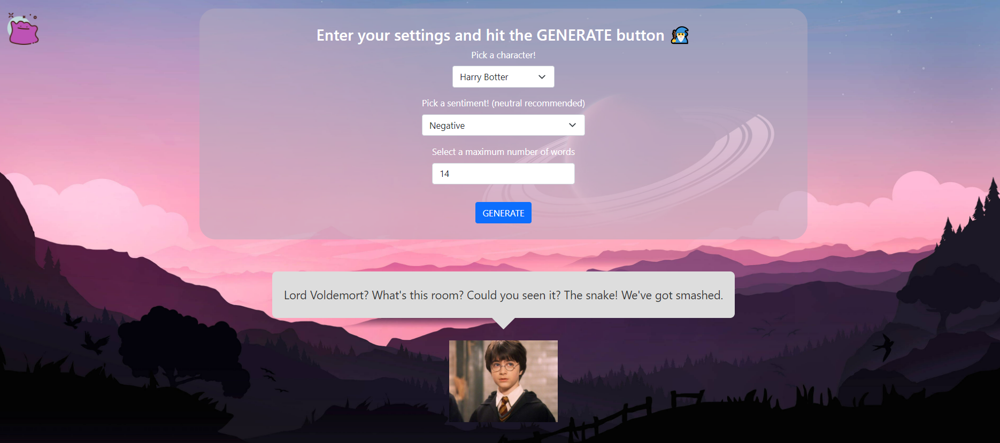

# 🧙‍♂️ DITTO

#### Ditto allows users to procedurally generate text using [Markov chain](https://en.wikipedia.org/wiki/Markov_chain) models given text as a corpus and sentiment as a parameter. You can either generate text from the pre-trained models available or input your own text and train your own Markov chain text generator! 

I have parsed the dialogue from all  the Harry Potter movies, Game of Thrones episodes, and The Office episodes (work in progress) to use as corpora for creating the text generators. You can generate text based on your favourite characters like Harry Potter or Albus Dumbledore.

- Harry Potter data retrieved from this [dataset](https://www.kaggle.com/kornflex/harry-potter-movies-dataset)
- Game of Thrones data retrieved from [here](https://www.kaggle.com/albenft/game-of-thrones-script-all-seasons)


#### Ditto is built using HTML/CSS to serve the front-end, and Python/Flask for the server-side API and the text generation.


## 🧝‍♂️ Try it yourself
1.  Clone and move into repository
```
 $ git clone https://github.com/addison-ch/Ditto.git
 ```
2. Install requirements

  ```
  $ pip install flask nltk
  ```
3. Run the server
 ```
  $ python app.py
  ```


## 🐎 Screenshot

